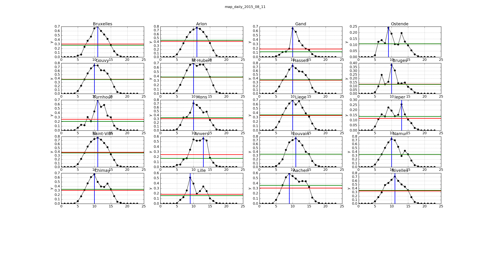

### Data sources

The french partner of EnergizAIR (Hespul) provides hourly forecasts
of PV production for 20 points in Belgium.
 <small>(or very near to it)</small>

How can we summarize this to be presented in 20" on TV?

Can we build a map about it?