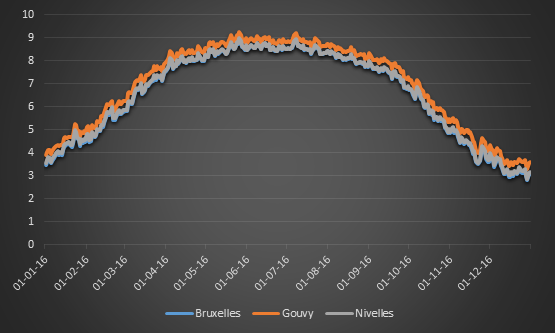

Data sources
============

To build our map, we need a csv file with the daily and hourly PV data for all the solar points.

We want to display a percentage of the **clear sky PV production**.

In other words, **is it a bright day for the season?**

TMY Clear Sky
-------------

Clear sky solar energy received on an inclined plane during a **normal year**.

This is an amount of solar energy expressed in kWh/m²*day (source météonorm).

Translate solar energy in PV energy per installed capacity kWh/m² in kWh/kWp:

    def _get_daily_meteonorm_tmy(self, month, day, solptid):
        
        # get the records for the given solar point and given day
        ctrl = TMY()
        records = ctrl.get_daily_tmy(month, day, solptid)
        hourly_meteonorm_tmys = [rec.clsky_meteonorm for rec in records]
        
        # sum all hourly values NB this is expressed in mWh\m²
        daily_clearsky = sum(hourly_meteonorm_tmys)

        # transform mWh\m² in kWh\kWp
        kWhperkWp = (daily_clearsky / 1000000) * e_pw_factor * std_inst_factor

        return kWhperkWp

CSV file
--------

Result daily power is expressed in percentage of clear sky.
Result hourly power is expressed in Wh/Wp.
