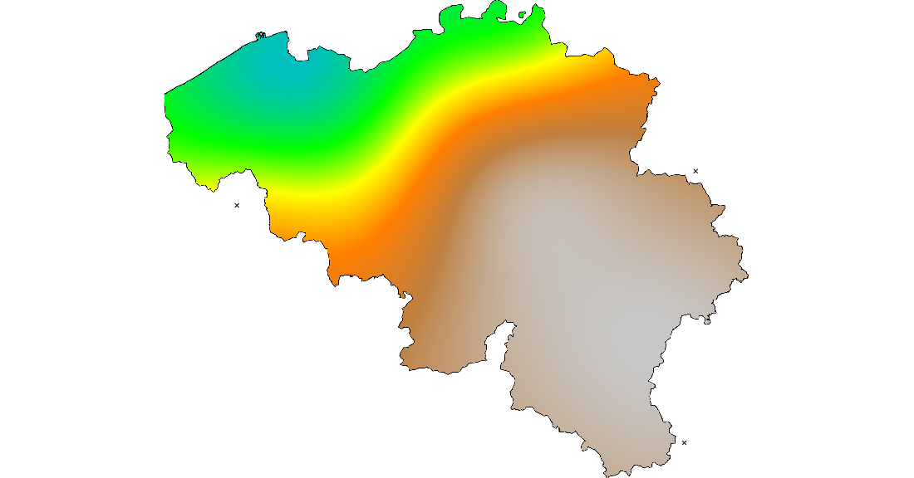
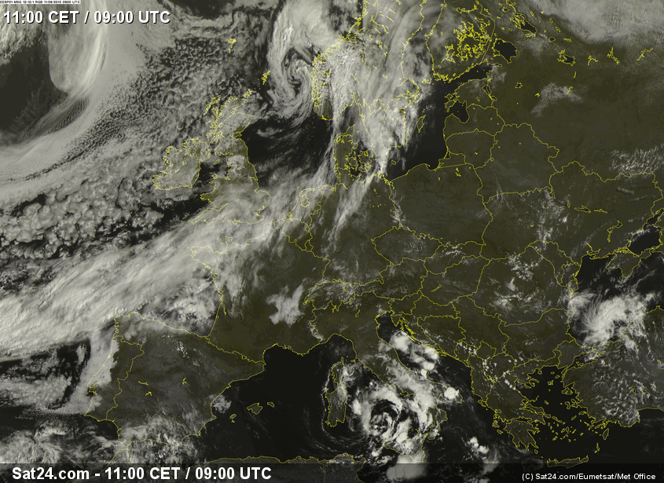

# GRASS

## How to find your way in GRASS

  * Launch the GUI
  * The help is disappointing, but finally well done
  * Selecting the GIS Database directory
  * Create your LOCATION
  * Create your MAPSET
  * Start the GUI

## Setup your project

Set the displayed region _(the 1st time you need a good friend)_: 

	g.region n=243900 s=21200 e=295950 w=23700 rows=4454 cols=5445 nsres=50 ewres=50
	
NB: why the extent of the gui is expressed differently?

## Add the vector map of Belgium

My country:

	v.in.ogr input=/home/jph/dev/aaa-foss4g/gis_data/be_31370/be_adm0.shp layer=be_adm0 output=be_adm0
	
The same with administrative divisions:

	v.in.ogr input=/home/jph/dev/aaa-foss4g/gis_data/be_31370/be_adm2.shp layer=be_adm2 output=be_adm2

## Add the data as vector point map

Let's test with the power production at 10 o'clock:

	v.in.ascii --overwrite input=/home/jph/dev/aaa-foss4g/gis_data/data/test_map_2015-08-11_10.csv output=data_map_2015_08_11_10 separator=comma skip=1

## Build a raster from the vector point map

We have chosen the rst interpolation:

	v.surf.rst --overwrite input=data_map_2015_08_11_10@mymapset zcolumn=dbl_3 elevation=rst_20150811H10 smooth=1

## Add a mask

I want to limit my raster to the country limits:

	r.mask --overwrite vector=be_adm0@mymapset
	
To directly build the raster including the mask:
	
	v.surf.rst --overwrite input=test_map_2015_08_11_10@mymapset zcolumn=dbl_3 elevation=rst_20150811H10 mask=MASK@mymapset smooth=1

## Save the result as an image

## Replay all

let's go:

	g.region n=243900 s=21200 e=295950 w=23700 rows=4454 cols=5445 nsres=50 ewres=50
	v.in.ogr input=/home/jph/dev/aaa-foss4g/gis_data/be_31370/be_adm0.shp layer=be_adm0 output=be_adm0
	v.in.ogr input=/home/jph/dev/aaa-foss4g/gis_data/be_31370/be_adm2.shp layer=be_adm2 output=be_adm2
	v.in.ascii --overwrite input=/home/jph/dev/aaa-foss4g/gis_data/data/test_map_2015-08-11_10.csv output=data_map_2015_08_11_10 separator=comma skip=1
	v.surf.rst --overwrite input=data_map_2015_08_11_10@mymapset zcolumn=dbl_3 elevation=rst_20150811H10 smooth=1
	r.mask --overwrite vector=be_adm0@mymapset
	