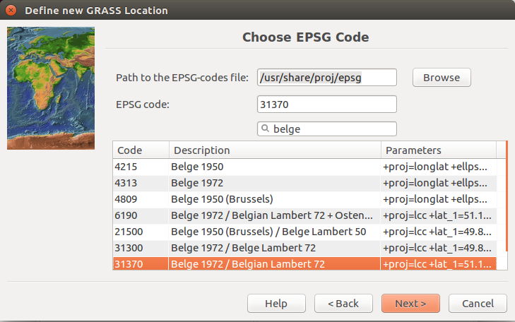

## GRASS

#### How to find your way in GRASS?
The **help** structure disappointed me, but it's well done.

Subscribe to the mailing list: 

	http://lists.osgeo.org/mailman/listinfo/grass-user

### Let's Grass
  * Launch the GUI
  * Selecting the GIS Database directory
  * Create your LOCATION
  * Create your MAPSET
  * Start the GRASS session

<a href="images/grass_00.png" target="_blank">

</a>

<a href="images/grass_01.png" target="_blank">

</a>

<a href="images/grass_02.png" target="_blank">

</a>

<a href="images/grass_03.png" target="_blank">

</a>

<a href="images/grass_04.png" target="_blank">

</a>

<a href="images/grass_05.png" target="_blank">

</a>

<a href="images/grass_06.png" target="_blank">

</a>

<a href="images/grass_07.png" target="_blank">

</a>

### Add the vector map of Belgium

<a href="images/grass_08.png" target="_blank">

</a>

<a href="images/grass_09.png" target="_blank">

</a>

<a href="images/grass_10.png" target="_blank">

</a>

<a href="images/grass_11.png" target="_blank">

</a>

<a href="images/grass_12.png" target="_blank">

</a>

Belgium:

	v.in.ogr 
	input=/home/jph/dev/aaa-foss4g/gis_data/be_31370/be_adm0.shp 
	layer=be_adm0 output=be_adm0
	
Belgian provinces:

	v.in.ogr 
	input=/home/jph/dev/aaa-foss4g/gis_data/be_31370/be_adm2.shp 
	layer=be_adm2 output=be_adm2

### Setup your project region

The geographic area in which GRASS should work:

  * geographical projection (e.g. Belgian Lambert 72, etc)
  * geographical extension, i.e. the North/South/East/West limits of the area covered
  * number of columns and number of rows for the data
  * resolution, i.e. the extension divided by the number of rows (N-S resolution), respectively columns (E-W resolution).

In other words, **_you need a good friend_** to set the region: 

	g.region n=243900 s=21200 e=295950 w=23700 rows=4454 cols=5445 nsres=50 ewres=50

### Add the PV forecasts as vector point map

<a href="images/grass_13.png" target="_blank">

</a>

<a href="images/grass_14.png" target="_blank">

</a>

<a href="images/grass_15.png" target="_blank">

</a>

<a href="images/grass_16.png" target="_blank">

</a>

All this is summarized in this command:

	v.in.ascii --overwrite 
	input=/home/jph/dev/aaa-foss4g/gis_data/data/test_map_2015-08-11_10.csv 
	output=data_map_2015_08_11_10 
	separator=comma 
	skip=1

### Build a raster from the vector point map

<a href="images/grass_17.png" target="_blank">

</a>

<a href="images/grass_18.png" target="_blank">

</a>

<a href="images/grass_19.png" target="_blank">

</a>

<a href="images/grass_20.png" target="_blank">

</a>

We have chosen the Regularized Spline Tension (rst) interpolation:

	v.surf.rst --overwrite 
	input=data_map_2015_08_11_10@jph 
	zcolumn=dbl_3 
	elevation=rst_20150811H10 
	smooth=1

### Add a mask

<a href="images/grass_21.png" target="_blank">

</a>

<a href="images/grass_22.png" target="_blank">

</a>

To limit my raster to the country limits:

	r.mask --overwrite vector=be_adm0@jph
	
To directly build the raster including the mask:
	
	v.surf.rst --overwrite 
	input=test_map_2015_08_11_10@jph 
	zcolumn=dbl_3 
	elevation=rst_20150811H10
	smooth=1 
	mask=MASK@jph 	

### Save the result as an image

<a href="images/sat20160811.gif" target="_blank">

</a>
