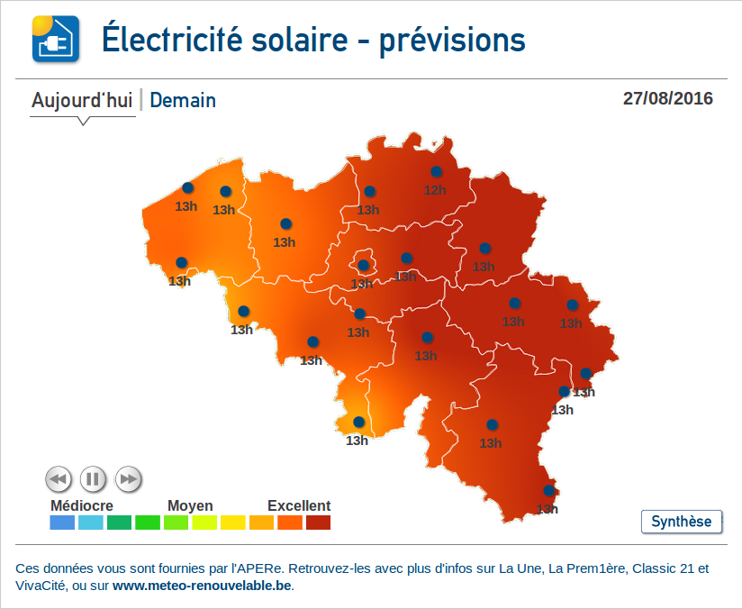

# leaflet

Used libraries:
  * jquery-2.2.3.min.js
  * leaflet.js
  * proj4-compressed.js
  * proj4leaflet.js

### Global settings

Windows bounds:

    beBounds : [[ 51.49, 2.54],[49.49, 6.42]],

Projection used by the map:

    belProjection : "+proj=lcc +lat_1=51.16666723333333 +lat_2=49.8333339 +lat_0=90 +lon_0=4.367486666666666 +x_0=150000.013 +y_0=5400088.438 +ellps=intl +towgs84=-106.869,52.2978,-103.724,0.3366,-0.457,1.8422,-1.2747 +units=m +no_defs",

    EPSG31370 : new L.Proj.CRS("urn:ogc:def:crs:EPSG::31370", belProjection,
            {
                resolutions: [8192, 4096, 2048, 1024, 512, 256, 128],
                origin: [0, 0]
              }),

Solar image bounds in  EPSG31370:

    beimgBounds : L.bounds([12500.00, 244000.00],[308600.00, 21000.00]),

#### Load the country map

buildMap :

    map = L.map('map-container', 
    			{center: [50.50, 4.50], zoom: 2.7, crs: EPSG31370});
    addPane('beadm2', 400);
    beadm2 = L.Proj.geoJson(map_be, 
    						{weight:0.5, 
    						color:"#fff", 
    						fill: false, 
    						pane: 'beadm2'}
    						).addTo(map);
    						
    buildPointsLayer();
    """ Add map event for responsiveness """
    map.on('popupclose', function(){
        resizeMap();
    });

#### Load PV points and manage projection settings with Proj4

buildPointsLayer :
    
    solpv_points = [];
    $.each(summaryData.zpoints, function(key, point){
    
        myIconPv = L.divIcon({className: 'geopoint-icon'
            , html: '<a tooltip="'+ point.solptname + '" href="#" class="geopoint">' + point_icon + '' + point.peak + 'h</a>'
            , iconAnchor: icon_anchor
            });
            
        myPopup = L.popup({className:"pv_popup"})
        				.setContent(buildPopupContent(point));
        
        belCoords = proj4(belProjection)
        				.inverse([ point.longitude, point.latitude]);
        				
        L.marker([belCoords[1], belCoords[0]],{icon: myIconPv})
        	.bindPopup(myPopup).openPopup().addTo(map);
        
    });

#### Add each hourly image and the daily summary as a pane
What are panes?

_In Leaflet, map panes group layers together implicitly. 
This grouping allows web browsers to work with several layers at once 
in a more efficient way than working with layers individually._

_Map panes use the **z-index** CSS property to always show some layers on top 
of others. This is why, popups always show “on top” of other layers, 
markers always show on top of tile layers, etc._

Add the solar image as background pane:

    sl = [];
    for (i = 0; i < (endHour - startHour); i++) {
        hr = startHour + i;
        sl[i] = {id: 'sl_' + hr, 
        	layer : addSolarLayer('map_hourly' + hr + '.png', 'sl_' + hr)};
    }
    
Add the daily synthesis map:

    sl[i] = {id: 'sl_day', 
    		layer : addSolarLayer('map_daily.png', 'sl_day')};

Add pane functions:
    
    addSolarLayer : function(imageUrl, id){
        var SL;
        addPane(id, 300);
        SL = L.Proj.imageOverlay(imageUrl, 
        						beimgBounds, 
        						{pane: id}).addTo(map);
        return SL
    },

	addPane : function(id, startZi){
        map.createPane(id);
        map.getPane(id).style.zIndex = startZi;
    },
    

#### Now you can play with the z-index of the different panes

						

#VaVersLeSoleil IFrame
