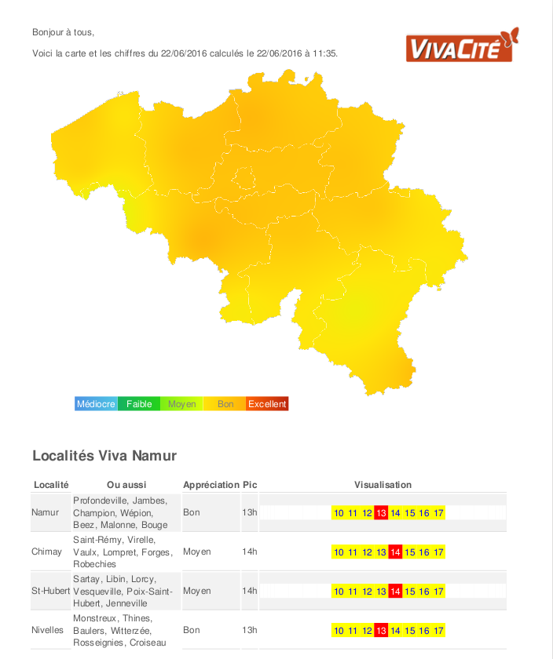

## Python Scripts

## Scripting GRASS

[https://grasswiki.osgeo.org/wiki/Working_with_GRASS_without_starting_it_explicitly](https://grasswiki.osgeo.org/wiki/Working_with_GRASS_without_starting_it_explicitly#Python:_GRASS_GIS_7_with_existing_location)

The EnergizAIR script:

	"""
	energizair.io.grass7_session
	
	Based on https://grasswiki.osgeo.org/wiki/Working_with_GRASS_without_starting_it_explicitly#Python:_GRASS_GIS_7_with_existing_location
	
	Class to start a Grass session using the installed grass.
	Tested only with grass version 7.
	The grass python scripting seems in its early stages, 
	I think this will evolve.
	
	"""

	__author__ = 'jph'
	__email__ = 'jph@openjph.be'
	__copyright__ = 'Copyright 2016, Jean Pierre Huart'
	__license__ = 'GPLv3'
	__date__ = '2016-03-03'
	__version__ = '1.0'
	__status__ = 'Development'
	
	import os
	import sys
	import subprocess
	from energizair.config import ENERGIZAIR_PATH
	
	COUNTRY_PATHS = {'BE': os.path.join(ENERGIZAIR_PATH, 'belgium/')}
	
	COUNTRY_LOCATIONS = {'BE': 'belgium31370'}
	COUNTRY_MAPSETS = {'BE': 'apere0'}
	
	
	class Grass7Session(object):
	    """
	    Instantiate a GRASS session and propose methods used by EnergizAIR
	    for map generation on png format.
	    This works only on Linux, for other OS check 
	
	    https://grasswiki.osgeo.org/wiki/Working_with_GRASS_without_starting_it_explicitly#Python:_GRASS_GIS_7_with_existing_location
	
	    """
	
	    def __init__(self, country, debug=True):
	        """
	        Each country will have it's own grass database 
	        thus it's own path, location and mapset
	        """
	        self.country = country
	        self.debug = debug
	        # The following is valid only for Linux
	        self.grass7bin = 'grass70'
	        # define GRASS DATABASE
	        # add your path to grassdata (GRASS GIS database) directory
	        self.gisdb = os.path.join(COUNTRY_PATHS[country], "grassdb")
	        # specify (existing) location and mapset
	        self.location = COUNTRY_LOCATIONS[country]
	        self.mapset = COUNTRY_MAPSETS[country]
	
	        return
	
	    def start_grass(self):
	        # query GRASS 7 itself for its GISBASE
	        startcmd = [self.grass7bin, '--config', 'path']
	
	        p = subprocess.Popen(startcmd
	        					, shell=False
	        					, stdout=subprocess.PIPE
	        					, stderr=subprocess.PIPE)
	        out, err = p.communicate()
	        if p.returncode != 0:
	            print >>sys.stderr, "ERROR: Cannot find GRASS GIS 7 start script (%s)" % startcmd
	            sys.exit(-1)
	
	        self.gisbase = out.strip('\n\r')
	
	        # Set GISBASE environment variable
	        os.environ['GISBASE'] = self.gisbase
	        # the following not needed with trunk
	        os.environ['PATH'] += os.pathsep
	        os.environ['PATH'] += os.path.join(self.gisbase, 'extrabin')
	        # add path to GRASS addons
	        home = os.path.expanduser("~")
	        os.environ['PATH'] += os.pathsep 
			os.environ['PATH'] += os.path.join(home
											  , '.grass7'
											  , 'addons'
											  , 'scripts')
	
	        # define GRASS-Python environment
	        gpydir = os.path.join(self.gisbase, "etc", "python")
	        sys.path.append(gpydir)
	
	        # DATA
	        # Set GISDBASE environment variable
	        os.environ['GISDBASE'] = self.gisdb
	
	        import grass.script.setup as gsetup
	        # launch session
	        gsetup.init(self.gisbase, self.gisdb, self.location, self.mapset)
	
	        import grass.script as gscript
	        self.gscript = gscript
	        return
	
	    def stop_grass(self):
	        self.gscript.message('End of GRASS script.')
	        sys.exit(0)
	        return
	
	    ############## EnergizAIR methods ##############################
	
	    def create_rst_interpolation_raster(self
	    									, input
	    									, elevation
	    									, zcolumn
	    									, smooth=0
	    									, tension=40
	    									, npmin=20
	    									, segmax=40):
	    
	        if self.debug:
	            self.gscript.message('Create interpolation RST raster')
	
	        result = self.gscript.run_command('v.surf.rst'
	        								, overwrite=True
	        								, input='{0}@{1}'.format(input, self.mapset)
	        								, zcolumn=zcolumn
	        								, elevation=elevation
	        								, mask='MASK@{0}'.format(self.mapset)
	        								, smooth=smooth
	        								, tension=tension
	        								, npmin=npmin
	        								, segmax=segmax
	        								, quiet=not self.debug)
	
	        if self.debug:
	            if result == 0:
	                result = 'Ok'
	
	            print(result)
	        return
	        
		
	    def insert_vector_csv(self, input, output):
	
	        if self.debug:
	            self.gscript.message('Insert the {0} csv data'.format(output))
	
	        columns = 'long double precision , lat double precision, power double precision, name varchar(255), date varchar(20), peak integer, plage varchar(255), grphplage varchar(50), maplon double precision , maplat double precision, h1 double precision,h2 double precision,h3 double precision,h4 double precision,h5 double precision,h6 double precision,h7 double precision,h8 double precision,h9 double precision,h10 double precision,h11 double precision,h12 double precision,h13 double precision,h14 double precision,h15 double precision,h16 double precision,h17 double precision,h18 double precision,h19 double precision,h20 double precision,h21 double precision,h22 double precision,h23 double precision, h24 double precision'
	        result = self.gscript.run_command('v.in.ascii'
	        								, overwrite=True
	        								, input=input
	        								, separator='comma'
	        								, skip=1
	        								, output=output
	        								, columns=columns
	        								, quiet=not self.debug)
	
	        if self.debug:
	            if result == 0:
	                result = 'Ok'
	
	            print(result)
	        return
	        
	
	    def insert_vector_shapefile(self, input, layer, output):
	    
	        if self.debug:
	            self.gscript.message('Insert the {0} shapefile'.format(output))
	
	        result = self.gscript.run_command('v.in.ogr'
	        								, overwrite=True
	        								, input=input
	        								, layer=layer
	        								, output=output
	        								, quiet=not self.debug)
	
	        if self.debug:
	            if result == 0:
	                result = 'Ok'
	
	            print(result)
	        return
	        
	
	    def remove_layer(self, type, name):
	        
	        if self.debug:
	            self.gscript.message('Remove a raster/vector map')
	
	        result = self.gscript.run_command('g.remove'
	        								, flags='f'
	        								, type=type
	        								, name='{0}@{1}'.format(name, self.mapset)
	        								, quiet=not self.debug)
	
	        if self.debug:
	            if result == 0:
	                result = 'Ok'
	
	            print(result)
	        return
	        
	
	    def save_png(self, filename, raster, map, height=960, width=1280):
	        """ Save the map in a png file with transparent background"""
	
	        # SETTINGS for PNG DRIVER
	        os.system('rm {0}'.format(filename))
	        os.environ['GRASS_RENDER_IMMEDIATE'] = 'png'
	        os.environ['GRASS_RENDER_FILE'] = filename
	        os.environ['GRASS_RENDER_FILE_READ'] = 'TRUE'
	        os.environ['GRASS_RENDER_TRANSPARENT'] = 'TRUE'
	        os.environ['GRASS_RENDER_HEIGHT'] = str(height)
	        os.environ['GRASS_RENDER_WIDTH'] = str(width)
	 
	        self.gscript.run_command('d.rast'
	        						, map='{0}@{1}'.format(raster, self.mapset)
	        						, quiet=not self.debug)
	        if map != '':
	            self.gscript.run_command('d.vect'
	            						, map='{0}@{1}'.format(map, self.mapset)
	            						, color='white'
	            						, fill_color='none'
	            						, quiet=not self.debug)
	
	        return True
	        
	
	    def set_color_palette(self, map, rules):
	        
	        if self.debug:
	            self.gscript.message('Set the color palette of the raster')
	
	        result = self.gscript.run_command('r.colors'
	        								, map='{0}@{1}'.format(map, self.mapset)
	        								, rules=rules
	        								, quiet=not self.debug)
	
	        if self.debug:
	            if result == 0:
	                result = 'Ok'
	
	            print(result)
	        return
	        
	
	    def set_mask(self, name):
	        
	        if self.debug:
	            self.gscript.message('Create a mask based on such map')
	
	        result = self.gscript.run_command('r.mask'
	        								, overwrite=True
	        								, vector='{0}@{1}'.format(name, self.mapset)
	        								, quiet=not self.debug)
	
	        if self.debug:
	            if result == 0:
	                result = 'Ok'
	
	            print(result)
	
	        return
	        
	
	    def set_region(self):
	        
	        if self.debug:
	            self.gscript.message('Modify the region parameters:')
	
	        if self.country == 'BE':
	            self.gscript.run_command('g.region'
	            						, n=243900
	            						, s=21200
	            						, e=295950
	            						, w=23700
	            						, rows=4454
	            						, cols=5445
	            						, nsres=50
	            						, ewres=50
	            						, quiet=not self.debug)

	        else:
	            print >>sys.stderr, "ERROR: undefined region for country (%s)" % self.country
	            sys.exit(-1)
	
	        if self.debug:
	            print self.gscript.run_command('g.region', flags='p')
	        return
	
	
	if __name__ == "__main__":
	    # Small self test
	    mysession = Grass7Session()
	    mysession.start_grass()
	    mysession.gscript.message('Current GRASS GIS 7 environment:')
	    print mysession.gscript.gisenv()

## Generate maps

## Save values as a json array

## Save them as PDF

