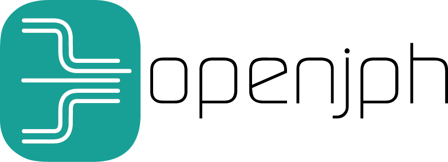

@jphuart

jph@openjph.be

Thank **you** for your kind attention.

 <small>This presentation is available at </small>

<small>https://github.com/jphuart/openjph-presentations/tree/master/FOSS4G-2016</small>

 <small>Thanks to reveal.js https://github.com/hakimel/reveal.js for the presentation framework.</small>

><small>Jean Pierre Huart - FOSS4G - 2016-09-22</small>	

