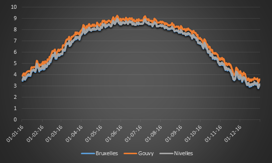
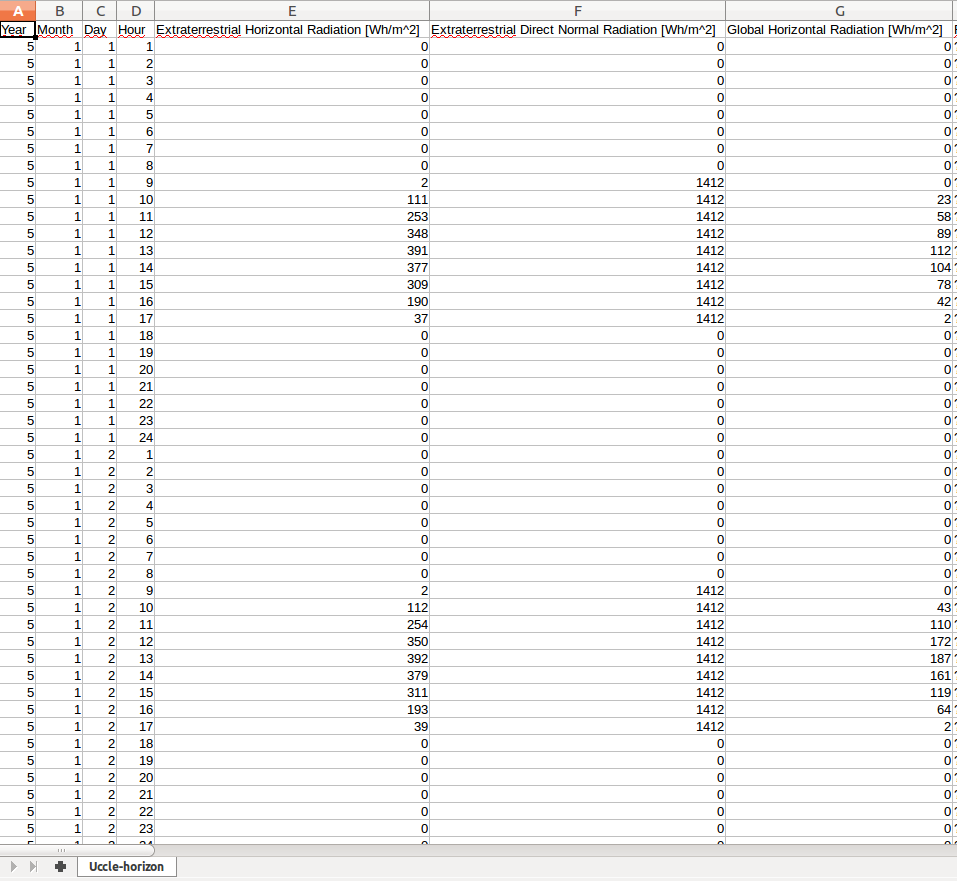
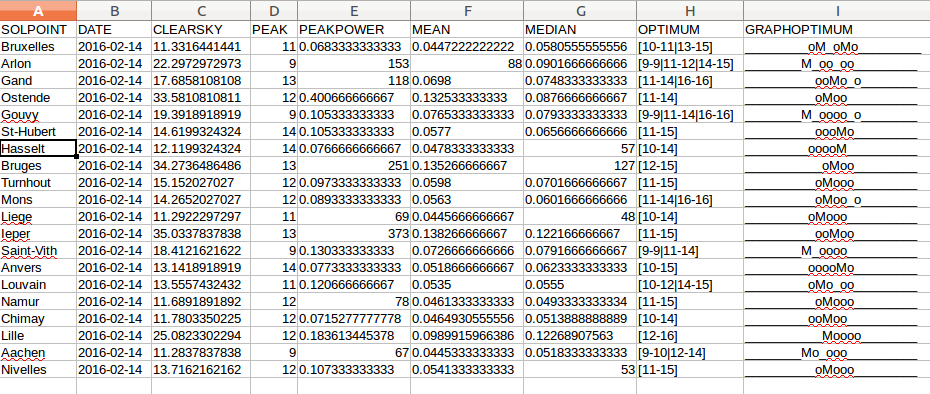

We would like to use an indicator that can be easily interpreted by anybody whatever installation he is using and something valid across seasons.

We decided to display a percentage of the **clear sky PV production**.

In other words, **is it a bright day for the season?**

### TMY Clear Sky

Clear sky solar energy received on an inclined plane during a **normal year**.

This is an amount of solar energy expressed in kWh/m²*day (source météonorm).

### CSV data file

Result daily power is expressed in percentage of clear sky.
Result hourly power is expressed in Wh/Wp.

