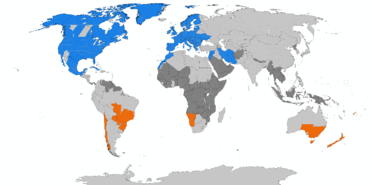

Merci à Mario Corchero pour sa présentation au FOSDEM 2017. 
Cette présentation en est une adaptation.

| Mesurer le temps - sablier |
|:----------------:|
|  |

| UT1 - La rotation de la terre |
|:----------------:|
|  |

## Pourquoi y a-t-il 24 heures dans une journée, 60 minutes dans une heure et 60 secondes dans une minute ?

Notre façon de calculer le temps remonte à l’antique Babylone 
(située dans l’Iraq d’aujourd’hui) à l’époque où a été créée notre écriture 
(il y a cinq mille ans environ).

Premièrement, par définition, le jour est le temps que met la Terre pour faire 
un tour sur elle-même, alors que l’année est ce qu’elle prend pour faire le tour 
du Soleil.  Or, la Terre réalise 365¼ rotations sur elle-même pendant qu’elle 
décrit une orbite autour du Soleil – d’où le fait que l’année compte 365 jours et un quart.

Deuxièmement, les Babyloniens comptaient non pas à coup de dix comme nous, 
mais par tranche de douze.  Comme nous, ils comptaient sur leurs doigts... 
ou plutôt sur leurs phalanges à l’aide du pouce.  Si donc vous touchez une à 
une les (trois) phalanges de chacun de vos quatre doigts à l’aide du pouce de 
la même main, vous obtiendrez douze chiffres. Les Babyloniens préféraient 
compter à coup de douze parce que ce nombre est divisible par 3, 4, 6 et 12, 
ce qui est beaucoup plus commode pour faire des calculs (division, multiplication, etc.) 
que de compter par dix, un nombre qui ne se divise que par 2, 5 et 10.  
(Notons que dans un système à base douze, des nombres tels que 12, 60 et 360 
sont des «chiffres ronds» au même titre que 10, 100 ou 1000 le sont dans notre système à base dix.) 

Troisièmement, les Babyloniens avaient observé qu’il s’écoule approximativement 
360 jours avant que le cycle des saisons et celui des constellations ne se 
reproduisent (c’est-à-dire avant que ne recommence une autre année).  
Or, coïncidence, le nombre 360 est un beau multiple de 12.  
Par conséquent, ils ont (entre autres) divisé le cercle en 360 degrés 
(assimilant le cycle des saisons à un cercle).

C’est ainsi qu’en comptant sur leurs doigts, les Babyloniens ont divisé le jour 
(la période diurne) en douze heures et la nuit en douze heures également – 
d’où la journée de 24 heures.  Ils ont aussi divisé l’année en douze mois, 
de même que le ciel en douze constellations principales (les douze signes du zodiaque).

Fidèles à leur système en base 12, ils ont divisé chaque heure en 60 minutes et 
chaque minute en 60 secondes. 

| TAI - Temps atomique |
|:----------------:|
|  |

La seconde = la durée de 9 192 631 770 périodes de la radiation correspondant à 
la transition entre les deux niveaux hyperfins de l'état fondamental de l'atome de césium 133.

| Fuseaux horaires - UTC offsets - GMT |
|:----------------:|
|  |

| Daylight Saving Time - DST |
|:----------------:|
|  |

# UNIX time

Unix time (also known as POSIX time or Epoch time) is a system for describing instants in time, 
defined as the number of seconds that have elapsed since 00:00:00 Coordinated Universal Time (UTC), 
Thursday, 1 January 1970, not counting leap seconds.
